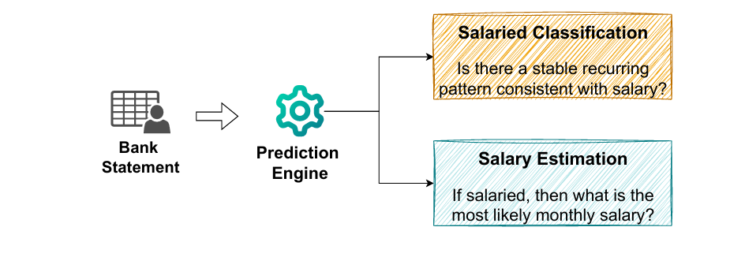
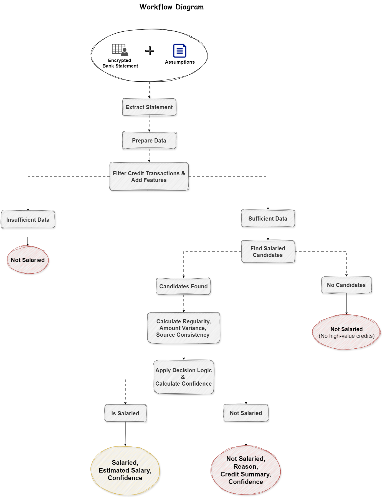

# Salary Detection Engine

This project builds a **rule-based salary detection engine** that works on single-user data. 
Essentially this system is not a classifier. It's more like an engine that
sees through one's financial behaviour, transaction patterns and signals based
on a pre-set of rules.


### **Note**: There will be use cases where bank transaction data will be fundamentally insufficient to predict 'Salaried Nature' with certainty

## Problem Statement
**Given a bank statement, build a system that:**
* Predicts whether user is Salaried.
* if YES, then estimate the monthly salary

----

## Approach
Encrypted file → Decrypt (msoffcrypto) → Parse Statements (Pandas) → Filter (Credit Only) → Detection Engine → JSON Output

#### Breaking down the Detection Engine:
1. **Clustering**: Identify the recurring high-value credit clusters
2. **Regularity Check**: Score transaction consistency across `Time` and `Amount`
3. **Source Consistency**: Check whether the incoming credits are consistent senders



----

## Why not ML?
* ML models require **labelled data** that represents its true nature.
* Historical data from a non-salaried bank statement can't be used to predict a salaried person. **Predictions won't be accurate**.
* Financial Logic requires **transaprent reasoning & decision making**. ML models can be black box.
* Rule-based approach are **easier to fine-tune** due to flexible thresholds

----

## How to RUN
Install prerequisites:
```
pip install -r requirements.txt
```

#### For normal bank statements
* Open `config.json` -> Add file path and password.
* Run `python salary_detector.py` directly from terminal.

#### For synthetic data test
* Choose between `salaried/freelancer/student`
* Choose no. of months
* Run the following command: 
```
python salary_detector.py --generate --user-type salaried --months 8
```
----

## Sample Output
#### Sample Bank Statement (Non-salaried)
```
RESULT
Is Salaried: False
Confidence Score: 0.81
Reason: Credits not regular enough: amount variance too high (CV: 0.21, threshold: 0.15)
```

#### Sample Test Data (Salaried, 8 months)
```
RESULT
Is Salaried: True
Estimated Salary: ₹39426
Confidence Score: 0.99
```

----

## Possible Edge cases
* Different file format (PDFs)
* Salary paid in cash
* Paid in cheque only for 2 month out of 6 months
* Early credit vs Late credit
* Freelancer working on project vs salaried employee
* Side income or Annual bonus or incentives

----

## Limitations
* Fixed thresholds/ Strict Rules
* Sudden significant salary increase / Recieving Large bonuses
* Limited Data window
* Purely Rule-based system, No learning
* Dependence on single source consistency

----

## Future Work
 * Use ML with larger historical data
 * Dynamic thresholds or personalization
 * Advanced Clustering for salaried candidates (like KMeans)
 * Use NLP techniques for matching keywords, identify statement, categorize transaction purpose, extract entities(sender names, trnasaction types)
 * Multi-source income detection feature

----

